# Ansible + HAProxy Lab

## Overview

This project demonstrates a practical infrastructure automation workflow using **Ansible, SSH, Docker, Nginx and HAProxy**.

The lab simulates a small production-style environment where Ansible acts as the automation and configuration-management layer. Two Nginx web servers provide the application backends, while HAProxy provides load balancing and health checks.

The project was intentionally kept simple and focused on the core skills expected for Linux / Infrastructure / Cloud / DevOps roles.

---

## Table of Contents

- [Overview](#overview)
- [Architecture Diagram](#architecture-diagram)
- [Project Overview](#project-overview)
- [Project Goals](#project-goals)
- [Technologies](#technologies)
- [Component Responsibilities](#component-responsibilities)
- [Project Summary](#project-summary)
- [Project Evolution](#project-evolution)
- [Ansible](#ansible)
- [HAProxy](#haproxy)
- [Project Structure](#project-structure)
- [Testing & Validation](#testing--validation)
- [Problems Encountered & Resolutions](#problems-encountered--resolutions)
- [Screenshots](#screenshots)
- [Cleanup](#cleanup)
- [Future Improvements](#future-improvements)
- [Contact](#contact)

---

## Architecture Diagram

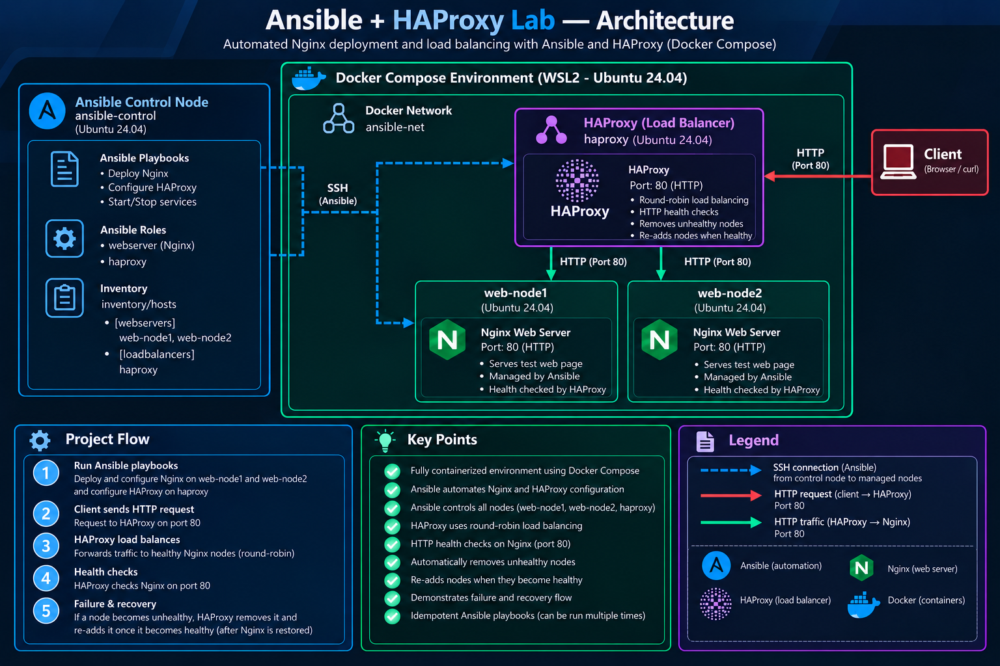

The lab runs as a Docker Compose environment on WSL2 with Ubuntu 24.04. The Ansible control node manages all three nodes over SSH, deploying and configuring Nginx on the two web nodes and HAProxy on the load balancer.

Client HTTP requests are sent to HAProxy on port 80, which distributes traffic between the Nginx backends using round-robin load balancing and HTTP health checks. Unhealthy backends are automatically removed from rotation and re-admitted once they become healthy again.

## Project Overview

The environment runs entirely with **Docker Desktop + WSL2**.

Ansible is used from a dedicated control node to connect over SSH to three managed nodes:

- `web-node1` — Nginx web server
- `web-node2` — Nginx web server
- `haproxy` — HAProxy load balancer

The containers are connected to a common Docker bridge network.

Nginx and HAProxy are **not installed through Dockerfiles**. They are installed, configured, validated and managed by Ansible.

## Project Goals

- Build a realistic Ansible control-node / managed-node architecture.
- Use SSH as the Ansible transport mechanism.
- Manage Linux services with Ansible.
- Create reusable Ansible roles.
- Use Jinja2 templates for configuration.
- Deploy and validate Nginx automatically.
- Deploy and validate HAProxy automatically.
- Configure HAProxy with two backend servers.
- Demonstrate round-robin load balancing.
- Demonstrate backend health checks.
- Demonstrate failure detection and recovery.
- Demonstrate Ansible idempotency.
- Keep the implementation simple and suitable for interview discussion.

---

## Technologies

| Technology | Purpose |
|---|---|
| Ubuntu 24.04 | Base operating system |
| Docker / Docker Compose | Lab infrastructure |
| WSL2 | Linux environment on Windows |
| Ansible | Configuration management and automation |
| SSH | Ansible transport to managed nodes |
| Nginx | Web servers / backend nodes |
| HAProxy | Load balancer and health checks |
| Jinja2 | Dynamic configuration templates |
| Git | Version control |

---

## Component Responsibilities

**Ansible Control Node**

The `ansible-control` container is responsible for:

- storing the Ansible inventory and playbooks;
- executing Ansible;
- connecting to managed nodes over SSH;
- applying roles and configuration.

**Managed Nodes**

The managed nodes are:

- `web-node1`
- `web-node2`
- `haproxy`

Ansible connects to these nodes using SSH and executes the required modules remotely.

**Web Servers**

`web-node1` and `web-node2` run Nginx and return different responses:

```text
Hello from web-node1
Hello from web-node2
```

This makes load-balancing behaviour easy to observe.

**HAProxy**

HAProxy listens on port 80 and distributes HTTP requests between the two Nginx backend servers using:

```text
balance roundrobin
```

It also uses HTTP health checks:

```text
option httpchk
```

and removes unavailable backend servers from rotation.

---

## Project Summary

The final lab provides a complete configuration-management workflow:

```text
Docker
  │
  ├── ansible-control
  │       │
  │       └── Ansible
  │              │
  │              └── SSH
  │
  ├── web-node1 ── Nginx
  │
  ├── web-node2 ── Nginx
  │
  └── haproxy ──── HAProxy
```

The important concept is that **Docker provides the infrastructure, while Ansible provides the configuration management**.

The containers themselves are intentionally minimal. Nginx and HAProxy are installed and configured by Ansible so that the project demonstrates actual configuration-management tasks rather than simply starting preconfigured application images.

---

## Project Evolution

The project was developed incrementally:

1. Created the project structure.
2. Built the Docker base images.
3. Generated the SSH key pair.
4. Started the four containers.
5. Established SSH connectivity.
6. Installed and verified Ansible on the control node.
7. Created the Ansible inventory.
8. Verified Ansible connectivity with `ping`.
9. Created the Nginx Ansible role.
10. Added the Nginx Jinja2 configuration template.
11. Added configuration validation and a reload handler.
12. Verified HTTP responses and idempotency.
13. Created the HAProxy Ansible role.
14. Added the HAProxy Jinja2 configuration template.
15. Added HAProxy validation and a reload handler.
16. Verified HAProxy service state.
17. Verified round-robin load balancing.
18. Tested backend failure detection.
19. Tested backend recovery.
20. Verified final idempotency and container state.
21. Prepared the project for documentation and GitHub.

---

## Ansible

### Ansible Control Node

Ansible is installed only on:

```text
ansible-control
```

The managed nodes do not require Ansible to be installed. They require SSH access and Python for Ansible modules.

Ansible version verified in the lab:

```text
ansible [core 2.16.3]
Python 3.12.3
```

### Inventory

The inventory separates the servers into logical groups:

```ini
[webservers]
web-node1
web-node2

[loadbalancers]
haproxy

[all:vars]
ansible_user=ansible
ansible_private_key_file=/home/ansible/.ssh/ansible_ed25519.lab
```

This allows playbooks to target only the required infrastructure.

For example:

```yaml
hosts: webservers
```

targets both Nginx servers, while:

```yaml
hosts: loadbalancers
```

targets the HAProxy node.

### Ansible Connectivity

Connectivity was verified using:

```bash
ansible all -i inventory/hosts -m ping
```

All three managed nodes returned:

```text
SUCCESS
pong
```

This verified the complete path:

```text
Ansible
   ↓
SSH
   ↓
Managed Node
   ↓
Python / Ansible module
   ↓
pong
```

---

### Ansible Roles

The project uses separate roles:

```text
ansible/
├── ansible.cfg
├── inventory/
│   └── hosts
├── playbooks/
│   ├── webservers.yml
│   └── haproxy.yml
└── roles/
    ├── webserver/
    │   ├── handlers/
    │   │   └── main.yml
    │   ├── tasks/
    │   │   └── main.yml
    │   └── templates/
    │       └── nginx.conf.j2
    │
    └── haproxy/
        ├── handlers/
        │   └── main.yml
        ├── tasks/
        │   └── main.yml
        └── templates/
            └── haproxy.cfg.j2
```

Using roles keeps the configuration modular and makes the project easier to extend.

---

## HAProxy

### HAProxy Role

The HAProxy role performs four main actions:

1. Install HAProxy.
2. Deploy the HAProxy configuration.
3. Validate the configuration.
4. Ensure HAProxy is running.

The configuration is deployed using a Jinja2 template.

After a configuration change, Ansible notifies the handler:

```yaml
- name: Reload HAProxy
  ansible.builtin.service:
    name: haproxy
    state: reloaded
```

This separates configuration changes from service reload logic.

### HAProxy Configuration

The final configuration contains:

```text
frontend http_front
    bind *:80
    default_backend web_servers
```

and:

```text
backend web_servers
    balance roundrobin
    option httpchk
    server web-node1 web-node1:80 check
    server web-node2 web-node2:80 check
```

The configuration defines an HTTP frontend listening on port 80 and a backend containing the two Nginx web servers.

- `frontend http_front` — receives incoming HTTP traffic.
- `bind *:80` — makes HAProxy listen on port 80.
- `default_backend web_servers` — sends frontend traffic to the backend.
- `balance roundrobin` — distributes requests between the two web servers.
- `option httpchk` — enables HTTP health checks.
- `check` — enables health checking for each backend server.

When a backend becomes unavailable, HAProxy removes it from the active rotation. After the backend recovers, it can be added back into rotation.

### Round-Robin

HAProxy distributes requests between the two backend servers:

```text
Request 1 → web-node1
Request 2 → web-node2
Request 3 → web-node1
Request 4 → web-node2
...
```

The actual lab test produced alternating responses from the two servers.

### Health Checks & Failover

HAProxy uses HTTP health checks to verify the availability of each backend:

```text
option httpchk
server web-node1 web-node1:80 check
server web-node2 web-node2:80 check
```

When web-node1 became unavailable, HAProxy removed it from the active rotation and the tested requests were served by web-node2.

After web-node1 was recovered through Ansible, traffic was again distributed between both backend servers.

This demonstrates backend health checking, automatic failover, and automatic re-admission of the backend after Nginx was restored through Ansible.

---

## Project Structure

```text
ansible-haproxy-lab/
│
├── ansible/
│   ├── ansible.cfg
│   ├── inventory/
│   │   └── hosts
│   ├── playbooks/
│   │   ├── webservers.yml
│   │   └── haproxy.yml
│   └── roles/
│       ├── webserver/
│       │   ├── handlers/
│       │   │   └── main.yml
│       │   ├── tasks/
│       │   │   └── main.yml
│       │   └── templates/
│       │       └── nginx.conf.j2
│       │
│       └── haproxy/
│           ├── handlers/
│           │   └── main.yml
│           ├── tasks/
│           │   └── main.yml
│           └── templates/
│               └── haproxy.cfg.j2
│
├── docker/
│   ├── ansible-control/
│   │   └── Dockerfile
│   └── managed-node/
│       └── Dockerfile
│
├── screenshots/
│   ├── architecture-diagram.png
│   ├── 01-ansible-connectivity-ping.png
│   ├── 02-webserver-role-handler.png
│   ├── 03-webserver-http-and-idempotency.png
│   ├── 04-haproxy-role-handler.png
│   ├── 05-haproxy-idempotency.png
│   ├── 06-haproxy-load-balancing.png
│   ├── 07-final-verification.png
│   ├── ssh-permission-denied-diagnosis.png
│   ├── ssh-permission-fix-success.png
│   ├── et5-role-not-found.png
│   ├── et5-role-path-fix.png
│   ├── et7-container-restart-nginx-not-running.png
│   └── et7-ansible-recovery.png
│
├── ssh/
│   └── local lab SSH keys
│
├── .gitignore
├── compose.yaml
└── README.md
```

> The SSH private key is local lab infrastructure and must not be committed to GitHub.

---

## Testing & Validation

The project was validated progressively rather than only checking whether containers were running.

### 1. Docker Infrastructure

Verified:

```bash
docker compose ps
```

All four containers were running:

```text
ansible-control
web-node1
web-node2
haproxy
```

### 2. SSH Connectivity

SSH was verified from the Ansible control node to:

```text
web-node1
web-node2
haproxy
```

### 3. Ansible Connectivity

The Ansible `ping` module returned `pong` from all three managed nodes.

### 4. Nginx Deployment

The Nginx role successfully:

- installed Nginx;
- deployed the configuration;
- validated the configuration with `nginx -t`;
- started Nginx;
- enabled the service;
- reloaded Nginx through a handler after configuration changes.

### 5. Nginx HTTP Test

The two backend responses were verified:

```text
Hello from web-node1
Hello from web-node2
```

### 6. HAProxy Deployment

The HAProxy role successfully:

- installed HAProxy;
- deployed the configuration;
- validated the configuration with `haproxy -c`;
- started HAProxy;
- reloaded HAProxy through a handler.

### 7. Load Balancing

Multiple HTTP requests through HAProxy produced responses from both backend servers in alternating order.

### 8. Failure Test

`web-node1` was stopped.

HAProxy detected the backend as unavailable through its health checks and removed it from the active rotation.

All tested requests were then served by:

```text
web-node2
```

This demonstrated health-check based backend removal.

### 9. Recovery Test

After web-node1 was started again, the container was running but Nginx was not yet active because the container's main process is SSH.

The Nginx Ansible playbook was then executed to restore the Nginx service.

After Nginx became healthy again, HAProxy automatically detected the recovered backend and reintroduced it into the active rotation.

Traffic was again distributed between:

```text
web-node1
web-node2
```

This demonstrated automatic failover, and automatic re-admission of the node once Nginx was restored:

```text
web-node1 unavailable
        ↓
HAProxy health check detects failure
        ↓
web-node1 removed from rotation
        ↓
traffic served by web-node2
        ↓
Nginx restored through Ansible
        ↓
HAProxy detects healthy backend
        ↓
web-node1 reintroduced into rotation
```

---

### 10. Idempotency

The final Nginx playbook run produced:

```text
web-node1  changed=0
web-node2  changed=0
```

The final HAProxy playbook run produced:

```text
haproxy  changed=0
```

This demonstrates that Ansible did not make unnecessary changes when the desired state was already present.

---

## Problems Encountered & Resolutions

### 1. SSH Private Key Permissions Inside the Control Container

The private key was bind-mounted from the WSL host.

The mounted file retained the host ownership:

```text
ubuntu:ubuntu
```

while the container's Ansible user used a different UID/GID.

As a result, the Ansible user could not use the mounted key directly and could not initially write to the `.ssh` directory.

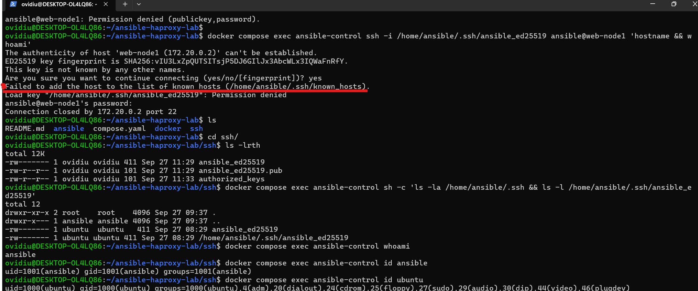

#### Resolution

The SSH private key is intentionally excluded from version control.

The control-node image was updated to create and correctly own:

```text
/home/ansible/.ssh
```

For this lab, the mounted key was then copied inside the container and assigned to the `ansible` user.

The final lab key used by Ansible was:

```text
/home/ansible/.ssh/ansible_ed25519.lab
```

SSH connectivity was then verified successfully to all three managed nodes.

This is a **lab-specific workaround** for the UID/GID behaviour of bind-mounted files. It is not intended as a production secret-management solution.

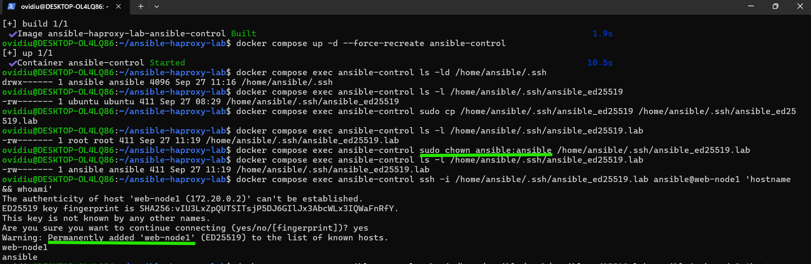

---

### 2. Ansible Role Not Found

When the webserver playbook was first validated, Ansible reported that the `webserver` role could not be found.

The project already contained an `ansible.cfg`, but Ansible was not loading it when the playbook was executed from outside the project working directory.

The configuration check showed:

```text
CONFIG_FILE() = None
```

As a result, Ansible was not using the project's configured role path.

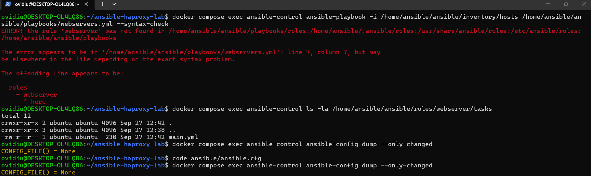

#### Resolution

Ansible was not loading it because the playbook was being executed outside the Ansible project directory.

Ansible reads `ansible.cfg` from the current working directory, so the playbook was executed from the Ansible project directory:

```bash
docker compose exec -w /home/ansible/ansible ansible-control ansible-playbook -i inventory/hosts playbooks/webservers.yml
```

With this working directory,

```bash
ansible-config dump --only-changed
```

showed:

```text
CONFIG_FILE() = /home/ansible/ansible/ansible.cfg
```

The configured role path was then detected correctly and the playbook syntax check succeeded.

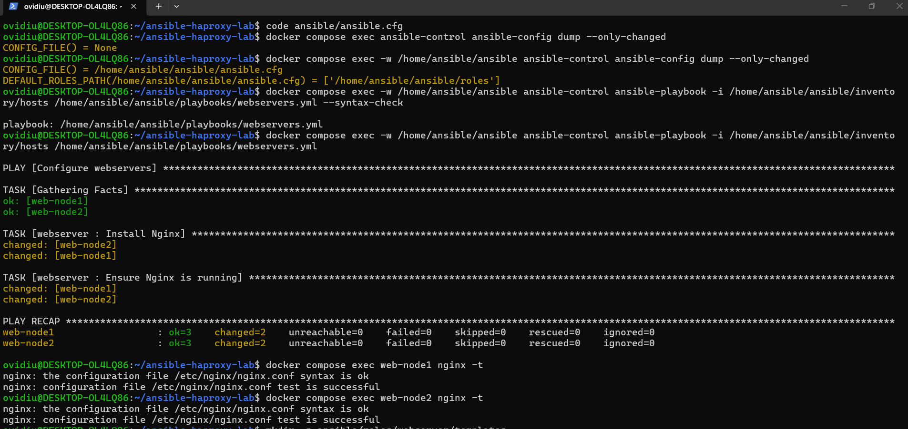

---

### 3. Inventory Group Name Conflict

The initial inventory used:

```ini
[haproxy]
haproxy
```

which caused a warning because the group and host had the same name.

#### Resolution

The group was renamed:

```ini
[loadbalancers]
haproxy
```

The resulting inventory clearly separates:

```text
webservers
loadbalancers
```

---

### 4. Container Restart vs. Nginx Service State

After `web-node1` was restarted with:

```bash
docker compose start web-node1
```

the container itself was running, but Nginx was not.

The reason is that the managed-node Docker container uses:

```text
/usr/sbin/sshd -D
```

as its main process.

Docker therefore starts SSH when the container starts; it does not start Nginx through systemd.

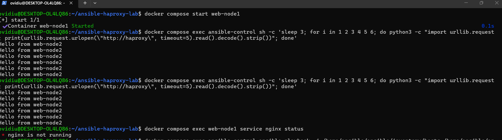

#### Resolution

The Ansible role still correctly contains:

```yaml
- name: Ensure Nginx is running
  ansible.builtin.service:
    name: nginx
    state: started
    enabled: true
```

Running the Ansible webserver playbook restored Nginx and returned the backend to HAProxy rotation.

This distinction is important when explaining the project in an interview:

```text
Docker container lifecycle
        ≠
Linux service lifecycle
```

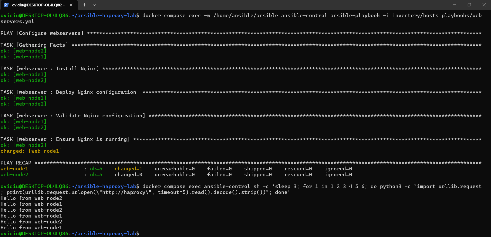

---

## Screenshots

### Main Functional Evidence

#### Ansible Connectivity

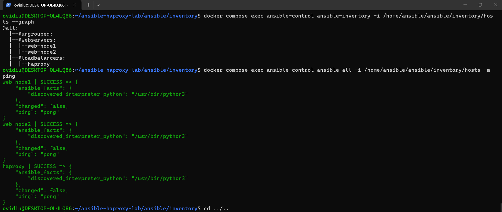

#### Webserver Role and Handler

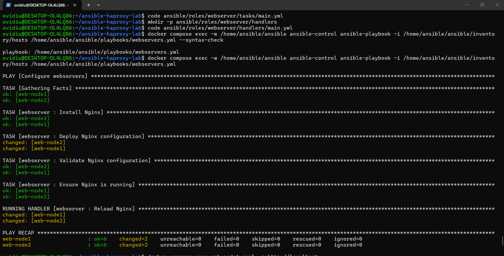

#### Nginx HTTP Response and Idempotency

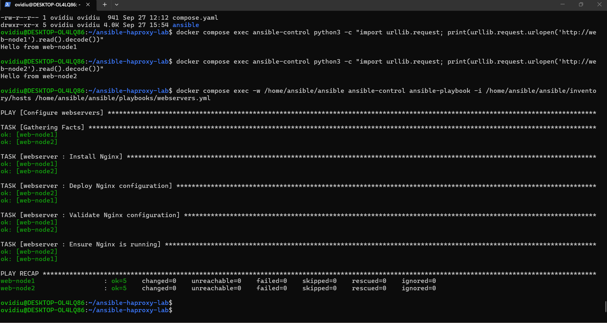

#### HAProxy Role and Handler

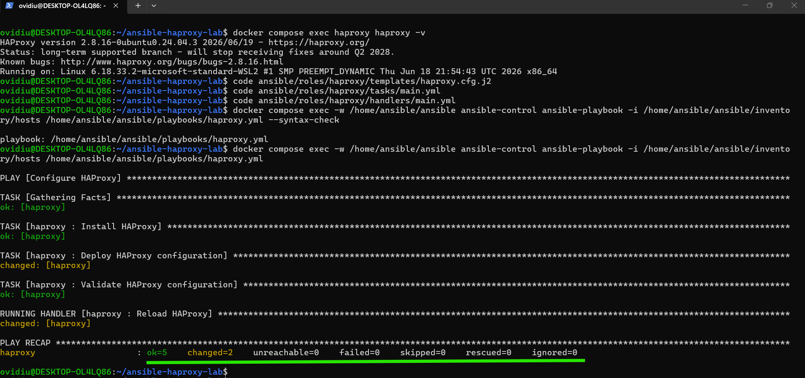

#### HAProxy Idempotency

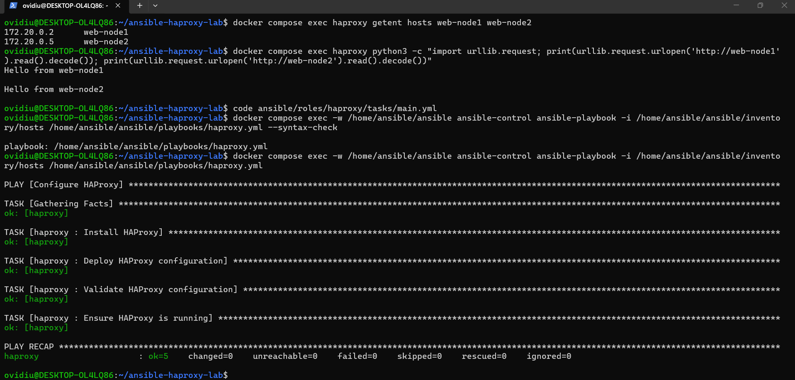

#### HAProxy Load Balancing

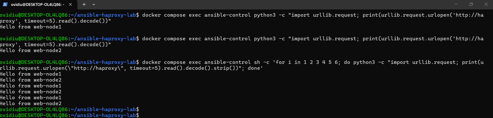

#### Final Verification

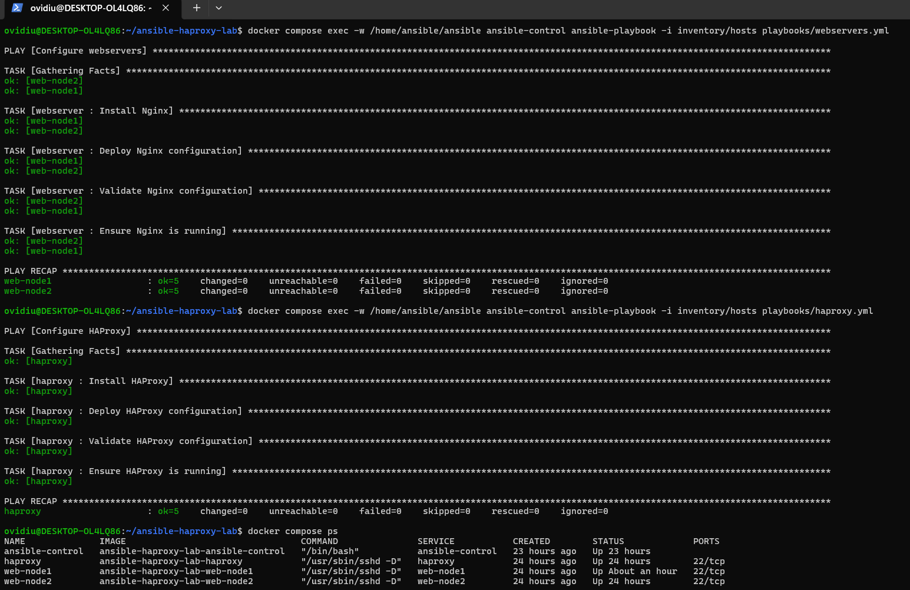

---

## Cleanup

To stop and remove the lab containers:

```bash
docker compose down
```

To remove the containers and associated images created for the project:

```bash
docker compose down --rmi local
```

The local SSH private key should remain outside Git history and should never be committed to the repository.

---

## Future Improvements

Possible future extensions, without changing the core architecture, include:

- HAProxy statistics page;
- persistent container volumes where appropriate;
- more advanced Ansible variables;
- environment-specific inventories;
- Ansible Vault for secrets;
- CI validation for Ansible syntax and linting;
- additional backend nodes;
- HTTPS termination at HAProxy.

These are intentionally outside the current implementation.

---

## Contact

- **GitHub:** [OvidiuN19](https://github.com/OvidiuN19)
- **LinkedIn:** [OvidiuNeagu](https://www.linkedin.com/in/ovidiu-dumitru-neagu-4680a8194/)